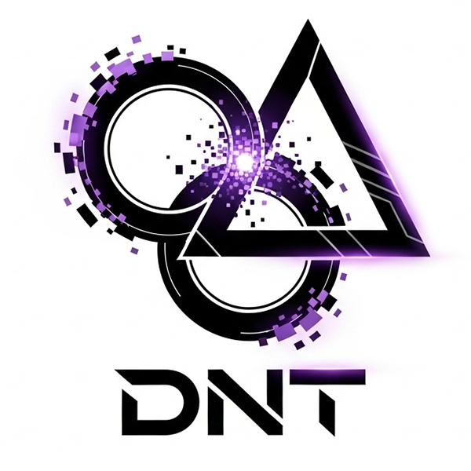

# 🚀 Dual Nova Lab



## ✨ Overview

Dual Nova Lab is a modern web development agency specializing in creating innovative digital solutions. Our team of skilled developers and designers craft beautiful, functional websites and applications tailored to meet your business needs.

## 🛠️ Tech Stack

- **Frontend**: React, TypeScript, Vite
- **Styling**: Tailwind CSS, shadcn/ui
- **Backend**: Supabase
- **Deployment**: Netlify

## 🔥 Features

- **Responsive Design**: Optimized for all devices
- **Modern UI/UX**: Beautiful, intuitive interfaces
- **Dashboard**: Client project management and analytics
- **Enquiry System**: Streamlined client communication
- **Performance Optimized**: Fast loading and rendering

## 📋 Services

- Web Development
- Mobile App Development
- UI/UX Design
- API Development
- Cloud Integration
- DevOps Automation
- AI/ML Solutions

## 🚀 Getting Started

### Prerequisites

- Node.js (v16+)
- npm or Bun

### Installation

```bash
# Clone the repository
git clone https://github.com/yourusername/dual-nova.git

# Navigate to project directory
cd dual-nova

# Install dependencies
npm install
# or
bun install

# Start development server
npm run dev
# or
bun dev
```

Visit `http://localhost:8082` in your browser to see the application.

## 📱 Contact Us

- **Email**: [dualnovalabs@gmail.com](mailto:dualnovalabs@gmail.com)
- **Phone**: +91 7306364765, +91 9072783958
- **Location**: Kochi, Kerala, India

## 📄 License

© 2024 Dual Nova Lab. All rights reserved.

---

<p align="center">Made with ❤️ by Dual Nova Lab</p>
